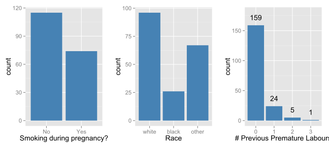
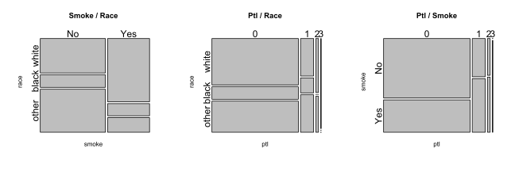

## Introduction

This R Markdown file uses the *slidify* package by Ramnath Vaidyanathan which is not on CRAN yet and has to be manually installed. I make also use of the interactive plotting capabilities provided by the *rCharts* package. Since these packages are still in rapid development and this feature was added only recently, the current development versions have to be installed  from Github. Luckily, this is as easy as typing three lines of R code, using the *devtools* package by Hadley Wickham:

```r
require(devtools)
install_github(c("slidify", "slidifyLibraries"), "ramnathv", ref = "dev")
install_github("rCharts", "ramnathv")
```


The knitted presentation in HTML format can also be accessed under the following address:
[Click me to open it in Brower](http://dl.dropboxusercontent.com/u/8439596/presentation/index.html).
To rebuild this R markdown document, it is also important to replace the *slidify.css* document in the folder ~/assets/css/slidify.css with the following custom file: 
[Download](http://dl.dropboxusercontent.com/u/8439596/presentation/assets/css/slidify.css) [Notice: the folder will be created after invoking knit("index.Rmd") for the first time]

---

## Load Required Packages


```r
require(knitr)
require(slidify)
require(rCharts)
require(xtable)
require(gridExtra)
require(ggplot2)
theme_set(new = theme_gray(base_size = 14))
require(lattice)
```


--- bg:#EEE
## Question 1: `survey` Data Set 

For the first question, we analyze a survey of 237 students at the University of Adelaide. All subsequently analyzed data sets come with the MASS package which can be loaded as follows:


```r
require(MASS)
data(survey)
```

The first four observations are displayed in the following table:

```r
df <- head(survey, n = 4)
print(xtable(df), type = "html")
```

<!-- html table generated in R 3.0.1 by xtable 1.7-1 package -->
<!-- Sun Sep 01 00:24:13 2013 -->
<TABLE border=1>
<TR> <TH>  </TH> <TH> Sex </TH> <TH> Wr.Hnd </TH> <TH> NW.Hnd </TH> <TH> W.Hnd </TH> <TH> Fold </TH> <TH> Pulse </TH> <TH> Clap </TH> <TH> Exer </TH> <TH> Smoke </TH> <TH> Height </TH> <TH> M.I </TH> <TH> Age </TH>  </TR>
  <TR> <TD align="right"> 1 </TD> <TD> Female </TD> <TD align="right"> 18.50 </TD> <TD align="right"> 18.00 </TD> <TD> Right </TD> <TD> R on L </TD> <TD align="right">  92 </TD> <TD> Left </TD> <TD> Some </TD> <TD> Never </TD> <TD align="right"> 173.00 </TD> <TD> Metric </TD> <TD align="right"> 18.25 </TD> </TR>
  <TR> <TD align="right"> 2 </TD> <TD> Male </TD> <TD align="right"> 19.50 </TD> <TD align="right"> 20.50 </TD> <TD> Left </TD> <TD> R on L </TD> <TD align="right"> 104 </TD> <TD> Left </TD> <TD> None </TD> <TD> Regul </TD> <TD align="right"> 177.80 </TD> <TD> Imperial </TD> <TD align="right"> 17.58 </TD> </TR>
  <TR> <TD align="right"> 3 </TD> <TD> Male </TD> <TD align="right"> 18.00 </TD> <TD align="right"> 13.30 </TD> <TD> Right </TD> <TD> L on R </TD> <TD align="right">  87 </TD> <TD> Neither </TD> <TD> None </TD> <TD> Occas </TD> <TD align="right">  </TD> <TD>  </TD> <TD align="right"> 16.92 </TD> </TR>
  <TR> <TD align="right"> 4 </TD> <TD> Male </TD> <TD align="right"> 18.80 </TD> <TD align="right"> 18.90 </TD> <TD> Right </TD> <TD> R on L </TD> <TD align="right">  </TD> <TD> Neither </TD> <TD> None </TD> <TD> Never </TD> <TD align="right"> 160.00 </TD> <TD> Metric </TD> <TD align="right"> 20.33 </TD> </TR>
   </TABLE>


--- 
## Smoking Behaviour of Students


```r
par(mfrow = c(1, 2))
plot(survey$Smoke, ylab = "count")
title("Barplot without Reordering")
survey$Smoke <- factor(survey$Smoke, levels = c("Never", "Occas", "Regul", "Heavy"))
plot(survey$Smoke, ylab = "count")
title("Barplot with Reordering")
```


--- .class #id 

## How often do the Students exercise?


```r
exer.tab <- xtabs(~survey$Exer)
par(mfrow = c(1, 2))
barplot(rep(1, length(exer.tab)), exer.tab, space = 0, names.arg = names(exer.tab), 
    col = c("lightblue", "mistyrose", "lavender"))
title(main = "Spine Chart without Reordering", xlab = "Exercise Level", ylab = "Count")

barplot(rep(1, length(exer.tab)), exer.tab[c(2, 3, 1)], space = 0, names.arg = names(exer.tab[c(2, 
    3, 1)]), col = c("mistyrose", "lavender", "lightblue"))
title(main = "Spine Chart with Reordering", xlab = "Exercise Level", ylab = "Count")
```


---

## Interpretation 

Concerning the amount of time each student devotes to exercising, the spine charts reveal that there is only a minority of students who do not do any sports at all, with two other almost equally sized groups who practice either sometimes or frequently. However, with only three data points to display, the same information could also be conveyed by the use of a simple table.  Of the two plots, it is advisable to go with the ordered one, as the exercise level is an ordinal variable and should be treated as such. If one does not take the inherent ordering into account, this will likely lead to misunderstandings the viewer will not notice unless he carefully looks at the labels. 

Similarly, the bar plots on Page 4 show that the overwhelming majority of students does not smoke at all, with less than a quarter of students smoking either occasionally, regularly or heavily. In each of these sub-categories, there are fewer and fewer cases  
with increasing smoking level. It is again advisable to use the ordered chart, as the initial ordering is arbitrary, while there is an inherent ordering of the categories which should be reflected. 

---
## Interactive Highcharts.js Plot
<script type='text/javascript' src=http://code.jquery.com/jquery-1.9.1.min.js></script>
<script type='text/javascript' src=http://code.highcharts.com/highcharts.js></script>
<script type='text/javascript' src=http://code.highcharts.com/highcharts-more.js></script>
<div id='hchart1' class='rChart highcharts'></div>
<script type='text/javascript'>
    (function($){
        $(function () {
            var chart = new Highcharts.Chart({
 "dom": "hchart1",
"width":    800,
"height":    400,
"credits": {
 "href": null,
"text": null 
},
"title": {
 "text": "Exercise / Smoking" 
},
"yAxis": {
 "title": {
 "text": null 
} 
},
"chart": {
 "type": "column",
"renderTo": "hchart1" 
},
"plotOptions": {
 "column": {
 "stacking": "normal" 
} 
},
"xAxis": {
 "title": "Exercising",
"categories": [ "No Exercising", "Some Exercising", "Frequent Exercising" ] 
},
"series": [
 {
 "name": "No Smoking",
"data": [     18,     84,     87 ] 
},
{
 "name": "Occasional Smoking",
"data": [      3,      4,     12 ] 
},
{
 "name": "Regular Smoking",
"data": [      1,      7,      9 ] 
},
{
 "name": "Heavy Smoking",
"data": [      1,      3,      7 ] 
} 
],
"id": "hchart1" 
});
        });
    })(jQuery);
</script>


As can be seen, there does not seem to be any significant relationship between the two categorical variables.

---
## Code for previous plot


```r
df <- as.data.frame(matrix(c(87, 12, 9, 7, 18, 3, 1, 1, 84, 4, 7, 3), ncol = 4, 
    nrow = 3))
colnames(df) <- c("No Smoking", "Occasional Smoking", "Regular Smoking", "Heavy Smoking")
rownames(df) <- c("Freq", "None", "Some")

a <- rCharts:::Highcharts$new()
a$chart(type = "column")
a$title(text = "Exercise / Smoking")
a$plotOptions(column = list(stacking = "normal"))
a$xAxis(categories = c("No Exercising", "Some Exercising", "Frequent Exercising"))
a$data(df)
a$print("hchart1", include_assets = TRUE, cdn = TRUE)
```


--- bg:#EEE
  
## Question 2: `birthwt` Data Set##
  
In this part of the presentation, we study the *birthwt* data set which also comes with MASS. It comprises 189 observations of 10 different variables, with the goal to discover risk factors associated with low infant birth weight (see the help page of the data set by typing `?birthwt` in the console). 

We limit our attention to the following three variables:

   - race: race of the mother, one of white, black or other
   - smoke: smoking status during pregnancy
   - ptl: number of previous premature labours
  

---

## Empirical Distributions

Displayed are bar plots for the univariate distributions of the three considered variables. 



---
## Mosaic Plots to Display Contingency Tables

```r
par(mfrow = c(1, 3))
cortable1 <- table(birthwt[, c("smoke", "race")])
mosaicplot(cortable1, cex.axis = 1.5, main = "Smoke / Race")
cortable2 <- table(birthwt[, c("ptl", "race")])
mosaicplot(cortable2, cex.axis = 1.5, main = "Ptl / Race")
cortable3 <- table(birthwt[, c("ptl", "smoke")])
mosaicplot(cortable3, cex.axis = 1.5, main = "Ptl / Smoke")
```




--- &twocol

## Results: Smoke and Race ##

*** =left

 


*** =right

From the first plot, one can deduce that the proportion of people who smoked during pregnancy is much larger among white people than the two other groups. For people with black skin, the situation is not as clear-cut, with roughly 40% of the group smoking during pregnancy. However, mothers from the category comprising all other races smoke much less during pregnancy, with more than three quarters refraining from doing so. A Chi-squared test rejects the null hypothesis of independence (p-value: 0), affirming that this association is not a result of pure chance. 

--- &twocol

## Results: Smoke and # Premature Labours 

*** =left

 


*** =right

While there does not appear to be any association between race and the number of premature labours, a look at the mosaic-plot on the left suggests that there is an association between smoking behaviour and premature labours. Mothers who smoke during pregnancy had more premature labours in the past, an observation which is in line with current research suggesting that smoking during pregnancy increased the risk of a premature birth. 

--- bg:#EEE
  
## Question 3: `minn38` Data Set##

Finally, we look at the `minn38` data set, which contains characteristics about high school graduates of 1938 from Minnesota (type `?help(minn38)` in R). 


```r
data(minn38)
minn38.tab <- xtabs(formula = f ~ phs + fol + sex, minn38)
minn38.tab.M <- xtabs(formula = f ~ phs + fol, minn38[minn38$sex == "M", ])
minn38.tab.F <- xtabs(formula = f ~ phs + fol, minn38[minn38$sex == "F", ])
```


Code for plots on the next pages:

```r
df1 <- as.data.frame(minn38.tab.F)
n1 <- nPlot(Freq ~ phs, group = "fol", type = "multiBarChart", data = df1)
# n1$set(width=800,height=500)
df2 <- as.data.frame(minn38.tab.M)
n2 <- nPlot(Freq ~ phs, group = "fol", type = "multiBarChart", data = df2)
# n2$set(width=800,height=500)
```


--- 
## Female High School Graduates 
Interactive Bar Chart:

<div id='nchart1' class='rChart nvd3'></div>
<script type='text/javascript'>
 $(document).ready(function(){
      drawnchart1()
    });
    function drawnchart1(){  
      var opts = {
 "dom": "nchart1",
"width":    800,
"height":    400,
"x": "phs",
"y": "Freq",
"group": "fol",
"type": "multiBarChart",
"id": "nchart1" 
},
        data = [
 {
 "phs": "C",
"fol": "F1",
"Freq":    525 
},
{
 "phs": "E",
"fol": "F1",
"Freq":     79 
},
{
 "phs": "N",
"fol": "F1",
"Freq":     54 
},
{
 "phs": "O",
"fol": "F1",
"Freq":    283 
},
{
 "phs": "C",
"fol": "F2",
"Freq":    377 
},
{
 "phs": "E",
"fol": "F2",
"Freq":    132 
},
{
 "phs": "N",
"fol": "F2",
"Freq":    106 
},
{
 "phs": "O",
"fol": "F2",
"Freq":    535 
},
{
 "phs": "C",
"fol": "F3",
"Freq":    457 
},
{
 "phs": "E",
"fol": "F3",
"Freq":    462 
},
{
 "phs": "N",
"fol": "F3",
"Freq":    171 
},
{
 "phs": "O",
"fol": "F3",
"Freq":   1677 
},
{
 "phs": "C",
"fol": "F4",
"Freq":    415 
},
{
 "phs": "E",
"fol": "F4",
"Freq":    154 
},
{
 "phs": "N",
"fol": "F4",
"Freq":    122 
},
{
 "phs": "O",
"fol": "F4",
"Freq":    715 
},
{
 "phs": "C",
"fol": "F5",
"Freq":    119 
},
{
 "phs": "E",
"fol": "F5",
"Freq":     68 
},
{
 "phs": "N",
"fol": "F5",
"Freq":     36 
},
{
 "phs": "O",
"fol": "F5",
"Freq":    348 
},
{
 "phs": "C",
"fol": "F6",
"Freq":     70 
},
{
 "phs": "E",
"fol": "F6",
"Freq":     56 
},
{
 "phs": "N",
"fol": "F6",
"Freq":     24 
},
{
 "phs": "O",
"fol": "F6",
"Freq":    409 
},
{
 "phs": "C",
"fol": "F7",
"Freq":     64 
},
{
 "phs": "E",
"fol": "F7",
"Freq":     40 
},
{
 "phs": "N",
"fol": "F7",
"Freq":     24 
},
{
 "phs": "O",
"fol": "F7",
"Freq":    339 
} 
]
  
      var data = d3.nest()
        .key(function(d){
          return opts.group === undefined ? 'main' : d[opts.group]
        })
        .entries(data)
      
      nv.addGraph(function() {
        var chart = nv.models[opts.type]()
          .x(function(d) { return d[opts.x] })
          .y(function(d) { return d[opts.y] })
          .width(opts.width)
          .height(opts.height)
         
        
          
        

        
        
        
      
       d3.select("#" + opts.id)
        .append('svg')
        .datum(data)
        .transition().duration(500)
        .call(chart);

       nv.utils.windowResize(chart.update);
       return chart;
      });
    };
</script>


---
## Male High School Graduates##
Interactive Bar Chart:

<div id='nchart2' class='rChart nvd3'></div>
<script type='text/javascript'>
 $(document).ready(function(){
      drawnchart2()
    });
    function drawnchart2(){  
      var opts = {
 "dom": "nchart2",
"width":    800,
"height":    400,
"x": "phs",
"y": "Freq",
"group": "fol",
"type": "multiBarChart",
"id": "nchart2" 
},
        data = [
 {
 "phs": "C",
"fol": "F1",
"Freq":    559 
},
{
 "phs": "E",
"fol": "F1",
"Freq":     41 
},
{
 "phs": "N",
"fol": "F1",
"Freq":      9 
},
{
 "phs": "O",
"fol": "F1",
"Freq":    276 
},
{
 "phs": "C",
"fol": "F2",
"Freq":    407 
},
{
 "phs": "E",
"fol": "F2",
"Freq":     68 
},
{
 "phs": "N",
"fol": "F2",
"Freq":     28 
},
{
 "phs": "O",
"fol": "F2",
"Freq":    531 
},
{
 "phs": "C",
"fol": "F3",
"Freq":    290 
},
{
 "phs": "E",
"fol": "F3",
"Freq":     91 
},
{
 "phs": "N",
"fol": "F3",
"Freq":     40 
},
{
 "phs": "O",
"fol": "F3",
"Freq":   1376 
},
{
 "phs": "C",
"fol": "F4",
"Freq":    390 
},
{
 "phs": "E",
"fol": "F4",
"Freq":     70 
},
{
 "phs": "N",
"fol": "F4",
"Freq":     36 
},
{
 "phs": "O",
"fol": "F4",
"Freq":    747 
},
{
 "phs": "C",
"fol": "F5",
"Freq":    117 
},
{
 "phs": "E",
"fol": "F5",
"Freq":     26 
},
{
 "phs": "N",
"fol": "F5",
"Freq":      8 
},
{
 "phs": "O",
"fol": "F5",
"Freq":    299 
},
{
 "phs": "C",
"fol": "F6",
"Freq":     62 
},
{
 "phs": "E",
"fol": "F6",
"Freq":     24 
},
{
 "phs": "N",
"fol": "F6",
"Freq":     10 
},
{
 "phs": "O",
"fol": "F6",
"Freq":    340 
},
{
 "phs": "C",
"fol": "F7",
"Freq":     93 
},
{
 "phs": "E",
"fol": "F7",
"Freq":     21 
},
{
 "phs": "N",
"fol": "F7",
"Freq":     10 
},
{
 "phs": "O",
"fol": "F7",
"Freq":    238 
} 
]
  
      var data = d3.nest()
        .key(function(d){
          return opts.group === undefined ? 'main' : d[opts.group]
        })
        .entries(data)
      
      nv.addGraph(function() {
        var chart = nv.models[opts.type]()
          .x(function(d) { return d[opts.x] })
          .y(function(d) { return d[opts.y] })
          .width(opts.width)
          .height(opts.height)
         
        
          
        

        
        
        
      
       d3.select("#" + opts.id)
        .append('svg')
        .datum(data)
        .transition().duration(500)
        .call(chart);

       nv.utils.windowResize(chart.update);
       return chart;
      });
    };
</script>


---
## Results ##

One interesting and perhaps surprising result concerning the relationship between gender and post high school status is that women were more than twice as likely employed full-time than their male counterparts. Comparing the two plots from the previous pages, one can see that the bars differ indeed greatly in height: Roughly three times as many females compared to males were employed full-time (keep in mind that the two plots have a different scale on the y-scale).

Second, college enrolment is highest for pupils from a household in which the father's occupational level is "F1". Compared to all other categories of occupational level, this is the only group in which children who go on to enrol in college make up the largest group. To see this, it is advisable to deselect all other groups in the interactive plots and then make one-to-one comparisons between the individual groups.  

--- 
## Non-interactive percentage Barplot using Lattice


```r
minn38_prop_tab <- prop.table(minn38.tab, margin = c(2, 3))
barchart(Freq ~ fol | sex, groups = phs, data = as.data.frame(minn38_prop_tab), 
    stack = TRUE, xlab = "Post High School Status", ylab = "Percentage", auto.key = list(space = "right", 
        columns = 1, title = "Legend", cex.title = 1))
```


---

## Results 2

To render visible the distribution in the individual groups, the previous bar chart only displays the proportions inside the respective groups and not the total counts. This allows better insight into the composition of the groups. One last observation is that there seems to be a trend that with increasing occupational level the number of graduates enrolled in college diminishes, which is offset by an increase in graduates of the category "other". The proportion of graduates belonging to the other categories (full-time employment and non-collegiate school) does not vary as much. One blatant exception is given by category "F3", in which less than under this hypothesis expected 
graduates are college students. 
  
---

